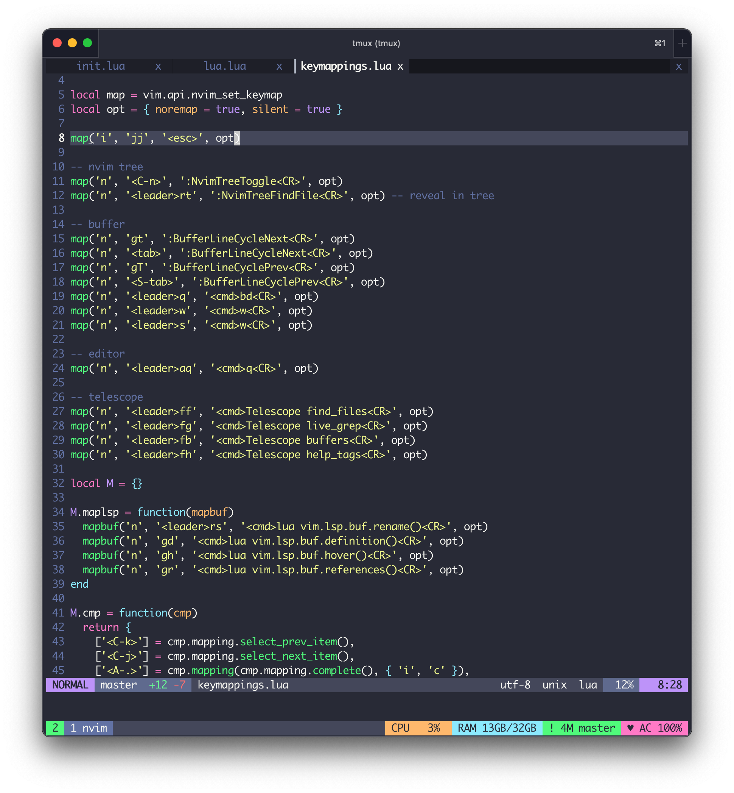

# nvim config



## Usage

Install neovim first.

And then install package manager [Packer](https://github.com/wbthomason/packer.nvim).

```sh
git clone --depth 1 https://github.com/wbthomason/packer.nvim\
 ~/.local/share/nvim/site/pack/packer/start/packer.nvim
```

Clone config files.

```sh
git clone git@github.com:wendellhu95/nvim.git ~/.config/nvim
```

And run `:PackerSync` in neovim.

## Links

[Dotfiles](https://github.com/wendellhu95/dotfiles).

## License

MIT. Copyright 2021 Wendell Hu.


